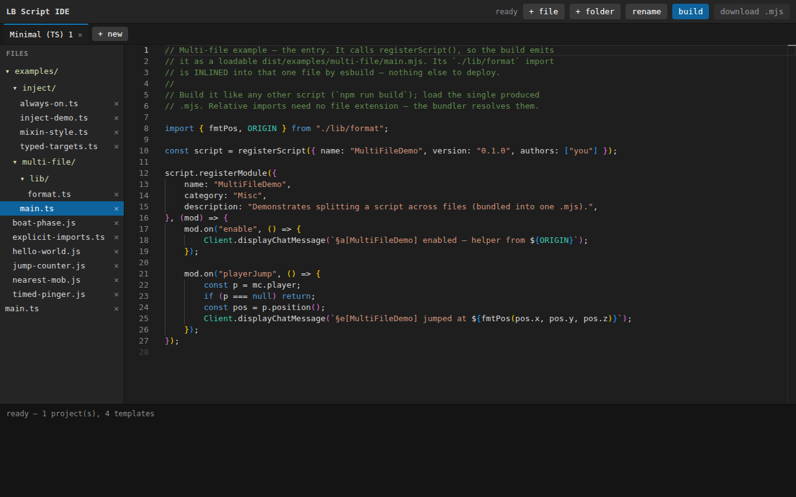

# lb-ide-explore

Evaluating browser-IDE architectures for **LiquidBounce TypeScript script
authoring**, with the specific goal that **each opened tab/session gets its own
isolated files** — something our current single-backend `code-server` image
(`../lb-web-ide`) cannot do.

This repo is **research only** (this phase). No implementation yet. Detailed
per-option findings live in [`docs/`](docs/); this README is the index +
comparison + recommendation.

## The use case (full context in [docs/00-context.md](docs/00-context.md))

- Authors edit TS type-checked against the npm package
  `@wunk/lb-script-api-types` (custom `.d.ts`, currently v0.38.4), then bundle
  with **esbuild** to a single `.mjs` dropped into the game client.
- Advanced workflow: `npm run dev` → hot-reload into a live client + GraalJS
  debugger on TCP `:9229`.
- Self-hosted on **one** Hetzner/Proxmox Ubuntu VM, **Docker but no Kubernetes**,
  fronted by **Caddy path-based routing** on shared domains (no per-project
  subdomains, no wildcard cert).

The decisive split: **does a user need the live-client debug loop, or only
author → type-check → build a downloadable `.mjs`?** The browser-only options
(Monaco, WebContainers) cannot reach a local game client; the server-side options
(Theia, Che) can in principle but cost real infra.

## The four options

| Option | Where code runs | Per-tab isolation | Runs our build? | Live `:9229` debug | Infra cost | Licensing |
|---|---|---|---|---|---|---|
| **Monaco + TS worker** | Browser | Free (each tab = own page) | esbuild-wasm in-tab | No | None (static files) | MIT |
| **StackBlitz WebContainers** | Browser (WASM Node) | Free | Real npm+esbuild in-tab | No | Static files + COOP/COEP | **Proprietary; 500 sessions/mo free cap** |
| **Eclipse Theia** | Server | **Not native** — needs orchestrator/k8s | Yes (full backend) | Plausible (unverified) | 1 container/session + builder | EPL-2.0 |
| **Eclipse Che** | Server (k8s pods) | Native (1 pod/workspace) | Yes (full backend) | Possible, cross-boundary | **Requires Kubernetes** | EPL-2.0 |

## Key findings per option

- **[Eclipse Theia](docs/01-eclipse-theia.md)** — Architecturally **identical to
  code-server** for our pain point: single backend per user, no native per-tab
  isolation. The only official multi-session story (**Theia Cloud**) mandates
  Kubernetes. Since you'd have to build a per-session container spawner anyway,
  that spawner could just launch our *existing* code-server image — Theia only
  wins if we later want a bespoke branded IDE. **Verdict: weak fit now.**

- **[Eclipse Che](docs/02-eclipse-che.md)** — Gives the **strongest** isolation
  (one k8s pod per workspace) but **requires Kubernetes** (no Docker-only path in
  7.x) and **prefers per-workspace subdomain routing** — both directly conflict
  with our single-VM, no-k8s, path-only-routing constraints. **Verdict: poor
  fit** unless we adopt single-node k8s and solve path routing experimentally.

- **[Monaco + TS worker](docs/03-monaco-ts-worker.md)** — Pure client-side. Real
  IDE-grade type-checking against our `.d.ts` with **zero backend**; per-tab
  isolation free; `esbuild-wasm` closes the build step in-browser. Costs are
  engineering: laying out our mixed ambient+module typings so imports resolve
  (`inmemory://`/node_modules-style paths), and an esbuild virtual-FS plugin.
  **Verdict: strong, arguably ideal fit** for "author + type-check + build,
  isolated, zero infra."

- **[StackBlitz WebContainers](docs/04-webcontainers.md)** — Runs real Node +
  npm + esbuild in-tab; per-tab isolation free; can run our *actual* build.
  **But** the runtime is **closed-source**, npm installs are **proxied through
  StackBlitz**, and the free tier is capped at **500 sessions/month** —
  commercial/multi-user use needs a paid agreement. Chromium-first (Firefox/Safari
  second-class). **Verdict: compelling for a small/OSS audience, risky as a
  hosted product** due to licensing.

## Recommendation (for discussion, not yet decided)

Neither server-side option is a good fit for our constraints: **Theia** gives us
nothing code-server doesn't, and **Che** needs Kubernetes + subdomains we can't
provide.

The realistic shortlist is the **browser-only** pair, since most LB script
authoring is "write typed code, build the `.mjs`, drop it in the client" — the
build never touches the game:

- **Monaco + TS worker** is the lowest-risk, fully-permissive, zero-dependency
  path. We control everything; only MIT deps. **The one real unknown is now
  resolved — see the spike below.**
- **WebContainers** is more capable (real npm/build, real terminal) but carries
  licensing + session-cap + StackBlitz-dependency baggage.

A likely end state is **two tiers**: the zero-infra browser tool (Monaco, maybe
esbuild-wasm) for the common author→build→download flow, and keep `code-server`
(or a local CLI) for the advanced live-client/`:9229` debug loop that no browser
sandbox can do.

## Spike: Monaco proven (✅ verified headless)

[`spikes/monaco-typings/`](spikes/monaco-typings/) — a working Monaco page that
loads `@wunk/lb-script-api-types` into the in-browser TS worker, verified
end-to-end in headless google-chrome (`node verify.mjs`):

```
good.ts          → 0 errors  (ambient globals + JVM-path module import both resolve)
bad.ts           → 3 errors  (incl. typed on() rejecting a bogus event name)
mc.* autocomplete→ 234 real members
closure shipped  → ~6 k files / 10.6 MB raw / ~1.2 MB gzipped  (NOT the full 96 MB)
```

Two findings that de-risk the Monaco path:
1. **The feared module-resolution quirk doesn't bite** if you mirror a real
   `node_modules/@wunk/...` layout + include the package's `package.json`
   (`typesVersions`) and use `NodeJs` resolution. Verified, not assumed.
2. **The 96 MB package must be sliced to its closure** (~1.2 MB gzipped per
   script) before shipping — `gen-bundle.mjs` does this via `tsc --listFiles`.

## Spike: in-browser build proven (✅ verified headless)

[`spikes/esbuild-wasm-build/`](spikes/esbuild-wasm-build/) — `esbuild-wasm`
bundles a multi-file project into the downloadable `.mjs` artifact, in-tab,
verified headless (`node verify.mjs`):

```
[ts] multi-file TS → 460 B single .mjs    [js] multi-file JS → 347 B single .mjs
  ✓ local helper inlined   ✓ type-only @wunk import erased
  ✓ no residual import/require (self-contained ESM)
  ✓ ambient globals (registerScript/…) preserved as runtime free-references
```

A small virtual-FS esbuild plugin serves the in-memory files; this mirrors the
template's Node `scripts/build.mjs`, moved into the browser. esbuild doesn't
type-check (Monaco does that) — together they cover the whole author→check→build
flow client-side.

## Status: validated → MVP built

Both engineering unknowns from the research are proven end-to-end, and they're
now wired into a working IDE — all zero backend, per-tab isolated:

```
type-check + autocomplete (TS and // @ts-check JS) ─ spikes/monaco-typings/    ✅
build → downloadable .mjs (TS and JS)              ─ spikes/esbuild-wasm-build/ ✅
MVP: editor + build + persistence + isolation      ─ app/                       ✅
```

Two working IDEs were built — same editor/persistence, different build engine:

### [`app/`](app/) — esbuild-wasm MVP (✅ verified headless, deployed)

Monaco + typings + **esbuild-wasm** + per-session IndexedDB persistence in one
page. Fully self-hosted, MIT-only, no external deps. All features asserted by
`app/verify.mjs`. **Live:** `https://host.example/lb-ide/`



### [`app-webcontainers/`](app-webcontainers/) — WebContainers edition (✅ verified, deployed)

Same IDE, but the build runs the **real Node + npm + native esbuild toolchain**
inside a StackBlitz WebContainer in-tab, with a live terminal. Needs cross-origin
isolation (COOP/COEP) and a secure context; npm installs are StackBlitz-proxied
(licensing caveat). Asserted by `app-webcontainers/verify.mjs`. **Live:**
`https://host.example/lb-ide-wc/`


Finding: **native esbuild runs in WebContainers**, so the template's actual
native-esbuild build works in-tab — not just a wasm reimplementation.

The only remaining piece is **persistence** (IndexedDB / File System Access API)
— a standard browser API, not a research risk. What stays intrinsically out of
browser scope: real `npm install`, a terminal, and the live-client / `:9229`
GraalJS debug loop (keep `code-server` / a local CLI for that tier).

## Layout

```
README.md                 this index + comparison + recommendation
docs/
  00-context.md           use case, constraints, the deciding question
  01-eclipse-theia.md
  02-eclipse-che.md
  03-monaco-ts-worker.md
  04-webcontainers.md
```
