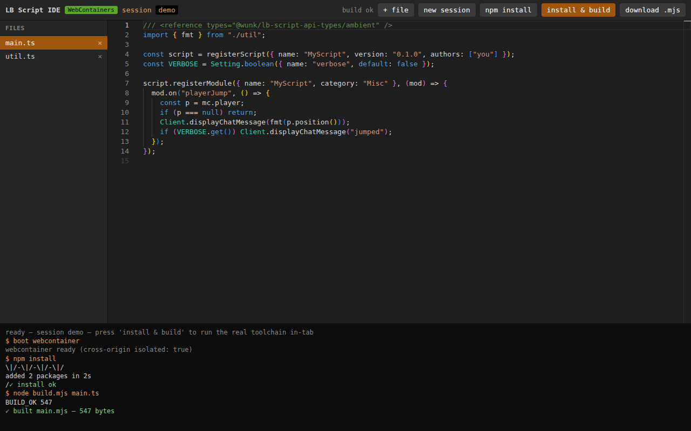

# lb-ide-app-webcontainers — WebContainers edition

The same browser LB script IDE as [`../app/`](../app/), but the **build runs the
real toolchain** — Node + npm + native esbuild — inside a
[StackBlitz WebContainer](https://webcontainers.io) in the tab, instead of
esbuild-wasm. So it executes the LB template's *actual* pipeline (`npm install`
then a native esbuild bundle), with a live terminal showing the output.

Editor (Monaco type-checking against `@wunk/lb-script-api-types`), per-session
IndexedDB persistence, and per-tab isolation are identical to the wasm app.



## What it proves (verified headless by `npm run verify`)

```
✓ page is cross-origin isolated (COOP/COEP)         ← required for WebContainers
✓ default project type-checks (Monaco)
✓ REAL build: boots WebContainer, `npm install` (pulls esbuild via StackBlitz
  proxy) + `node build.mjs` (native esbuild) → self-contained .mjs in-tab
✓ helper inlined, type-only @wunk import erased
✓ download the .mjs
✓ IndexedDB persistence survives reload
✓ per-session isolation
```

Notable finding: **native `esbuild` runs fine in WebContainers** (StackBlitz's
runtime handles it), so we can run the template's real native-esbuild build, not
just a wasm reimplementation.

## Run

```bash
npm install        # postinstall: gen-typings + bundle the @webcontainer/api
npm run serve      # http://localhost:8086  (serve.mjs sends COOP/COEP)
npm run verify     # headless google-chrome end-to-end (boot + real build)
npm run build-dist # assemble dist/ for serving behind Caddy
```

## Hosting requirements (vs the wasm app)

- **Cross-origin isolation is mandatory.** The host must send
  `Cross-Origin-Embedder-Policy: require-corp` and
  `Cross-Origin-Opener-Policy: same-origin`, and the page must be a **secure
  context** (HTTPS, or localhost). Assets are served with
  `Cross-Origin-Resource-Policy: cross-origin` so Monaco's opaque-origin worker
  loads under COEP. See `serve.mjs`; the Caddy route sets the same headers.
- **Outbound network**: `npm install` inside the container is proxied through
  **StackBlitz infrastructure** — the runtime is closed-source and not fully
  self-hostable offline. Free for prototypes/POCs; commercial multi-user use is
  capped (500 sessions/mo) and needs a StackBlitz agreement. See
  [`../docs/04-webcontainers.md`](../docs/04-webcontainers.md).
- **Chromium-first**: Firefox/Safari support for WebContainers is partial.

## wasm app vs WebContainers — when to use which

```
../app/ (esbuild-wasm)      fully self-hosted, MIT-only, no external deps,
                            works everywhere; build is a wasm esbuild.
this (WebContainers)        real npm + real toolchain + a terminal; can run
                            arbitrary project scripts — but closed-source runtime,
                            StackBlitz-proxied installs, licensing + session cap,
                            Chromium-first.
```

Neither can do the live-client / `:9229` GraalJS debug loop (browser-sandbox limit).

## Layout

```
public/index.html          layout (toolbar, file sidebar, editor, terminal)
public/main.js             Monaco + typings + WebContainer build + IndexedDB
public/webcontainer-api.js generated: bundled @webcontainer/api
public/typings-bundle.json generated: .d.ts closure for the editor
scripts/gen-typings.mjs    tsc --listFiles → typings-bundle.json
scripts/bundle-api.mjs     esbuild-bundle @webcontainer/api → one ESM file
scripts/build-dist.mjs     assemble static dist/
serve.mjs                  dev static server (COOP/COEP)
verify.mjs                 headless end-to-end assertions
```
