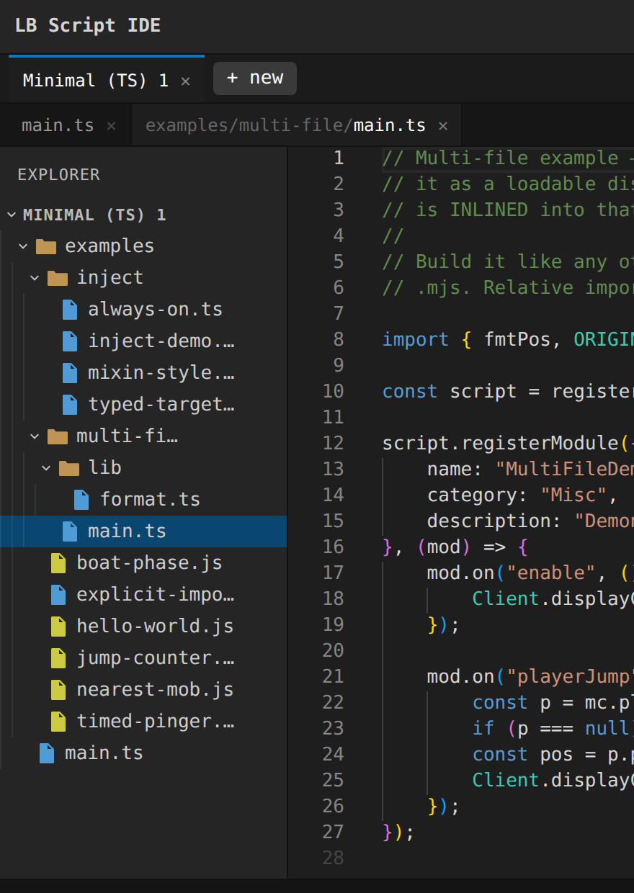

# lb-ide-app - the lean LiquidBounce script IDE

The **lean** mode of the dual-mode IDE (see [`../../README.md`](../../README.md)
for both modes): a **zero-backend** browser app, deployed to GitHub Pages.

- **Monaco** with `@wunk/lb-script-api-types` loaded into the TS worker →
  autocomplete + type-checking against the ambient globals and JVM-path imports
  (TS and `// @ts-check` JS).
- **esbuild-wasm** → bundles the multi-file project into one downloadable `.mjs`,
  entirely in the tab.
- **IndexedDB persistence**, keyed by a per-session id in the URL hash, so each
  tab/session has its own isolated files. "New session" mints a fresh one.

No server, no Docker, no accounts. Open the page and edit. The build pipeline is
shared with the heavy editor via [`@lb-ide/core`](../../packages/lb-ide-core/),
consumed buildlessly here via dynamic `import()`.

## Features

Verified headless by `npm run verify`:

```
✓ two-tier tabs: PROJECT tabs on top, OPEN-FILE (editor) tabs below — open
    files from the tree, switch/close tabs (close keeps the file); VS Code-style
    single-click preview tabs
✓ multiple projects in a tab bar, each its own files, persisted independently
✓ "+ new" picker grouped into CATEGORIES, merged across template tiers (bundled,
    user, fetched) with origin badges; each category = a "Blank project" + one
    project per example script
✓ template management: Save-as-template, Duplicate & edit, fetch from the default
    source (non-source files stripped on import), and a template/source manager
✓ multi-file projects with a collapsible FOLDER TREE (create/delete files +
    folders at any depth); cross-folder ./imports resolve & inline in the build
✓ "show supporting files" toggle (eye icon) — reveals the template's build
    script, vendored lib (lb-inject), configs & types (dimmed, hidden by default)
✓ live type-checking + autocomplete (TS and // @ts-check JS), moduleDetection
    forced so the many files don't collide in global scope
✓ build → self-contained .mjs (via @lb-ide/core), matching the template build
    conventions: JVM-type value imports → Java.type("<fqcn>"); `lb-inject` →
    inlined runtime; type-only @wunk imports erased; local ./imports inlined
✓ download the built .mjs · add / delete / rename files · go-to-definition
✓ themes (Dark + LiquidBounce) · share links (project gzipped in the URL hash)
✓ autosave to IndexedDB; projects survive reload; per-project isolation
```

In-client (active only when a host bridge is detected, see [`../host/`](../host/)):
build & run in client, hot-reload, debug attach (GraalJS inspector on `:9229`),
a typed REPL with live `log()` streaming, and open-an-installed-script. Plus an
"open in heavy" button to hand the current project to the heavy editor. These run
against the real client; they are exercised headless against a mock host but not
covered by `npm run verify`.

Bundled templates are generated from the in-repo sources by
`scripts/gen-templates.mjs` (into `public/templates.json` + the lb-inject
typings/runtime). The runtime-fetched tier comes from the repo's published
`templates.json` (see [`../../README.md`](../../README.md)).



## Run

```bash
npm install            # also runs gen-typings (postinstall) → public/typings-bundle.json
npm run serve          # http://localhost:8085
# or headless smoke test:
npm run verify         # needs google-chrome
```

`npm run gen-typings` regenerates the shipped typings closure (the ~6k-file /
~1.2 MB-gzipped slice of the 96 MB package that a representative script
references — see `scripts/gen-typings.mjs`).

> Dev note: `public/vs`, `public/esbuild.js`, `public/esbuild.wasm` are symlinks
> into `node_modules` (created here for local dev). A production build would copy
> these in and serve everything same-origin.

## Architecture

```
public/
  index.html     layout (toolbar, file sidebar, editor, log)
  main.js        Monaco + typings + file mgmt + esbuild build + IndexedDB + download
  typings-bundle.json   generated: the .d.ts closure shipped to the worker
  vs/ esbuild.*  monaco + esbuild-wasm assets (symlinked in dev)
scripts/gen-typings.mjs   tsc --listFiles → typings-bundle.json
serve.mjs        dev static server
verify.mjs       headless google-chrome end-to-end assertions
```

## Out of scope (intrinsic browser-sandbox limits)

Real `npm install` and a terminal can't run in a browser tab. Running and
debugging a script happen **in the client**: the build is in-tab, then the host
bridge loads it (and, for debug, the client runs GraalJS with the inspector on
`:9229`); the editor triggers that and shows the attach info, it doesn't run the
script itself.

## Next steps (not yet built)

- Lazy-load `.d.ts` on demand so arbitrary JVM-class imports get types beyond the
  shipped closure.
- Import an existing project; zip a project for download.
